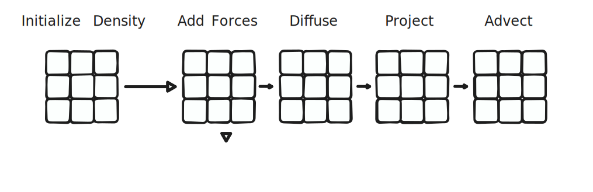
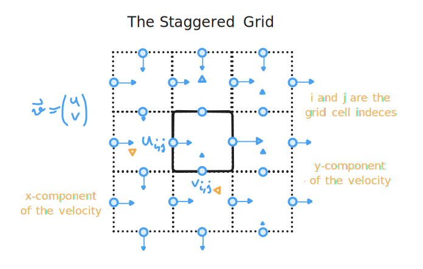

# Eulerian Fluid Simulator

<!--

-->

We will look at a 2D simulation here first. Moving to 3D is quite trivial. It is _Eulerian_ because we use a grid rather than points for the computations. Below, we will be mainly following the work of Matthias Müller [^1] [^2] with added details and insights from various other sources.

We assume that:
1. Water is an [incompressable fluid](https://en.wikipedia.org/wiki/Incompressible_flow).
2. It has no [viscosity](https://en.wikipedia.org/wiki/Viscosity) (even though adding it would be rather easy).

Our velocity vector

$$
    \vec{v} =
        \begin{pmatrix}
            v_x \\\\
            v_y 
        \end{pmatrix}
$$

are saved not within the centers of the cells (_"collocated"_ grid) but rather at the boundaries creating a so called _"staggered"_ grid.

The indices for the grid positions are notated as \\(i, j\\) .

||
|:-:| 
| **Figure 1.** *Outline of the fluid dynamics algorithm. We first initializse the densities and objects within the grid, then enter the simulation loop where we apply forces at each step, diffuse the fluid, the "project" in order to enforce compressibility, and lastely "advect" in order to redirect the velocities of the fluid.* |

||
|:-:| 
| **Figure 2.** *The staggered grid within which all the fluid dynamics are computed.* |

### Velocity Update
Now, for all \\(i,j\\) we update the velocity

$$
v_x^{i,j} \leftarrow v_x^{i,j} + \Delta t \cdot g
$$

with the gravity \\(g: -9.81\\;\\) m/s for time-steps \\(\Delta t\\) of e.g. \\(\frac{1}{30}\\;\\) s.

>**Question**: This is the simplest form of integration called the [Euler method](https://en.wikipedia.org/wiki/Euler_method). If you have ever worked with chaotic systems, you'll may know that this can lead to large errors quickly! So why does this work here? Or does it?

### Divergence (Total Outflow)
We calculate the total outflow of a cell as

$$
d \leftarrow v_x^{i,j+1}-v_x^{i,j} + v_y^{i+1,j} - v_y^{i,j}.
$$

If \\(d\\) is positive, we have too much outflow. If it is negative, we have too much inflow. Only if \\(d = 0\\) is our fluid as incompressible as we desire!

Thus we must force incompressibility!

### Forcing Incompressibility
First, we compute the divergence.
We can then handle obstacles or walls by fixing those velocity vectors. So for static object, that point of the border would be zero. But if it is moving this will of course impact the velocity and we can simulate how the fluid is being pushed around!

### General Case
It is useful to define the scalar value \\(s^{i,j}\\) for each cell, where objects are zero and fluids 1. We update it as

$$
s \leftarrow  s^{i+1. j} + s^{i-1, j} + s^{i,j+1} + s^{i,j-1}
$$

and

$$
v_x^{i,j} \leftarrow v_x^{i,j} + d \cdot s^{i-1,j}/s \\\\
v_x^{i+1,j} \leftarrow v_x^{i+1,j} + d \cdot s^{i+1,j}/s \\\\
v_y^{i,j} \leftarrow v_y^{i,j} + d \cdot s^{i,j+1}/s \\\\
v_y^{i,j+1} \leftarrow v_y^{i,j+1} + d \cdot s^{i,j+1}/s.
$$

Why?

### Solving the Grid
Naturally, we want to solve the whole grid. One, and possibly the simplest method here is to use the [Gauss-Seidel method](https://en.wikipedia.org/wiki/Gauss%E2%80%93Seidel_method):

For \\(n\\) iterations and for all \\(i,j\\) , we compute the general case.

An issue here is that we access boundary cells outside of the grid! To resolve this problem, we can add border cells and set \\(s^{i,j} = 0\\) for them to make them walls. Alternatively, we could copy the neighbor cells that are inside the grid.

### Measuring Pressure
We can also store a physical pressure value \\(p^{i,j}\\) inside each cell!

For the \\(n\\) iterations and all \\(i,j\\) , we can then additionally calculate it as

$$
    p^{i,j} \leftarrow p^{i,j} + \frac{d}{s}\cdot \frac{\rho \\; h}{\Delta t},
$$

where \\(\rho\\) is the density of the fluid and \\(h\\) is the grid spacing.

While not necessary for the simulation, it provides us with some interesting information without much additional effort!

### Over-Relaxation
While the Guass-Seidel method is very simple to implement, it needs more iterations than global methods. Here comes _"over-relaxation"_ into play.

We multiply the divergence by a scalar \\(1 \leq o \leq 2\\)

$$
d \leftarrow o\cdot(v_x^{i+1, j} - v_x^{i,j} + v_y^{i,j+1} - v_y^{i,j})
$$

e.g. \\(o=1.9\\) . Doing so increases the convergence of the method dramatically! It is very possible that the simulation will collapse and lead to an physically implausible result if we do not over-relax.

And the pressure values still remain correct!

### Semi-Lagrangian [Advection](https://en.wikipedia.org/wiki/Advection)
This section is going to be a bit weird and possibly difficult to understand.
The core question is simply: _"How do the **velocities** stream through the fluid?"_

In the real world, fluids are made of particles. We don't have static grids like we assume here. It is merely a useful abstraction. But we still need to move the velocity values in the grid just like the velocity state is carried by the particles in the real world since energy must be conserved!

While we don't actually simulate particles, this idea is why we call it a semi-Lagrangian approach. (Remember! _"Lagrangian"_ rather than _"Eulerian"_ because now we consider particles rather than a grid.)

Given a velocity within a grid \\( \vec{v}(t) \\) at time \\( t \\) , we want to know where the velocity came from, how it changed, hence \\( \vec{v}(t+\Delta t) \leftarrow \vec{v}(t) \\). For that, we compute \\( \vec{v} \\) at the position \\( \vec{x} \\) through simple differentiation i.e. computing 

$$
\vec{v}(t) = \vec{x}(t) - \vec{x}(t-\Delta t). 
$$

Knowing that local change dependent on the position \\( \vec{v}(x) \\) , we can approximate the previous position of the velocity as

$$
\vec{x} = \vec{x} - \Delta t \cdot \vec{v}(x)
$$

(Note that my notation here is everything else but consistent or precise but I hope you get the idea.)

This is another linear approximation. As the result, the viscosity of the fluid is increased. One possible solution to this issue is [_"vorticity confinement"_]().

To get the total 2D velocity within the grid cell we can simply take the average of the surrounding velocities:

$$
v^{i,j} = (v^{i-1,j} + v^{i,j-1} +v^{i+1,j} +v^{i,j+1})/4.
$$

And to calculate the velocity at any arbitrary position within the grid, hence, to interpolate, we can calculate a **weighted average** of the surrounding values

$$
\bar{v} = w^{00} \cdot w^{10} \cdot v^{i,j} + w^{01} \cdot w^{10} \cdot v^{i+1,j} \\\\
    \qquad \qquad + w^{10} \cdot w^{11} \cdot v^{i,j+1} + w^{11} \cdot w^{11} \cdot v^{i+1,j+1}
$$

where \\( w^{00} = 1 - x/h \\) , \\( w^{01} = x/h \\) , \\( w^{10} = 1 - y/h \\) , and \\( w^{11} = 1 - y/h \\) for the height \\( y \\) within the points and the width \\( x \\) within the points.

### Smoke Advection & Streamlines
We can store the density value at the center of each cell and _"advect"_ it just like the velocity components before. Quite useful for simulating smoke.

Calculating streamlines is rather straightforward as well. We start at the position \\(x_1\\) and step forward with the step-size \\(s\\) to get \\(x_2 \leftarrow s \cdot v(x_1) \\) and so on for \\(n\\) steps, each time sampling the velocity \\(v\\) at the corresponding position.

## References & Notes
### Matthias Müller's and Related Work
[^1]: [Matthias Müller, _"How to write an Eulerian fluid simulator with 200 lines of code."_, YouTube: Ten Minute Physics, 2022: _https://www.youtube.com/watch?v=iKAVRgIrUOU_ (Accessed: June 28, 2024)](https://matthias-research.github.io/pages/tenMinutePhysics/17-fluidSim.pdf)

[^2]: [Matthias Müller, _"Notes On Eulerian Fluid Simulations."_, GitHub, 2022: _https://matthias-research.github.io/pages/tenMinutePhysics/17-fluidSim.pdf_ (Accessed: June 28, 2024)](https://matthias-research.github.io/pages/tenMinutePhysics/17-fluidSim.pdf)

[^3]: [vassvik, _"Realtime Fluid Simulation: Projection"_](https://gist.github.com/vassvik/f06a453c18eae03a9ad4dc8cc011d2dc)

[^4]: 

### Jos Stam's Famous "Real-Time Fluid Dynamics for Games" Work
[^ClassicRealGameFluids]: [Jos Stam, _"Real-Time Fluid Dynamics for Games"_](http://graphics.cs.cmu.edu/nsp/course/15-464/Fall09/papers/StamFluidforGames.pdf)

[^MAsh_JosStam_Blog]: [Michael Ash, _"Fluid Simulation for Dummies"_, Blog, 2006: _https://mikeash.com/pyblog/fluid-simulation-for-dummies.html_ (Accessed: June 29, 2024)](https://mikeash.com/pyblog/fluid-simulation-for-dummies.html) The simulation code and ideas that are presented are based on Jos Stam's paper _Real-Time Fluid Dynamics for Games_ [^ClassicRealGameFluids]. How to parallelize the simulation and render the output in 3D is elaborated in Ash's Master's thesis [^AshMaster].

[^AshMaster]: [Michael Ash, _"Master Thesis: Simulation and Visualization of a 3D Fluid"_, 2005](https://www.mikeash.com/thesis/thesis-en.pdf)

[^YTVideo]: [The Coding Train, _"Coding Challenge #132: Fluid Simulation"_](https://www.youtube.com/watch?v=alhpH6ECFvQ)

## Other Research Publications
[^Visco]: [S. Clavet, P.Beaudoin, and P. Poulin, _"Particle-based Viscoelastic Fluid Simulation"_, ACM SIGGRAPH Symposium on Computer Animation, 2005](https://www.researchgate.net/profile/Pierre-Poulin/publication/220789321_Particle-based_viscoelastic_fluid_simulation/links/0c96051824f22359e2000000/Particle-based-viscoelastic-fluid-simulation.pdf?origin=publication_detail&_tp=eyJjb250ZXh0Ijp7ImZpcnN0UGFnZSI6InB1YmxpY2F0aW9uIiwicGFnZSI6InB1YmxpY2F0aW9uRG93bmxvYWQiLCJwcmV2aW91c1BhZ2UiOiJwdWJsaWNhdGlvbiJ9fQ)
